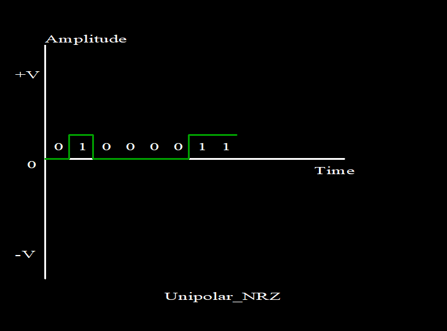

<h1 style="color:#FC5258">Line Coding Techniques</h1>

Line coding is the process of converting digital data to digital signals. By this technique we can convert a sequence of bits to a digital signal. That is what implimented in this project.

 

<h3>Unipolar NRZ</h3>

